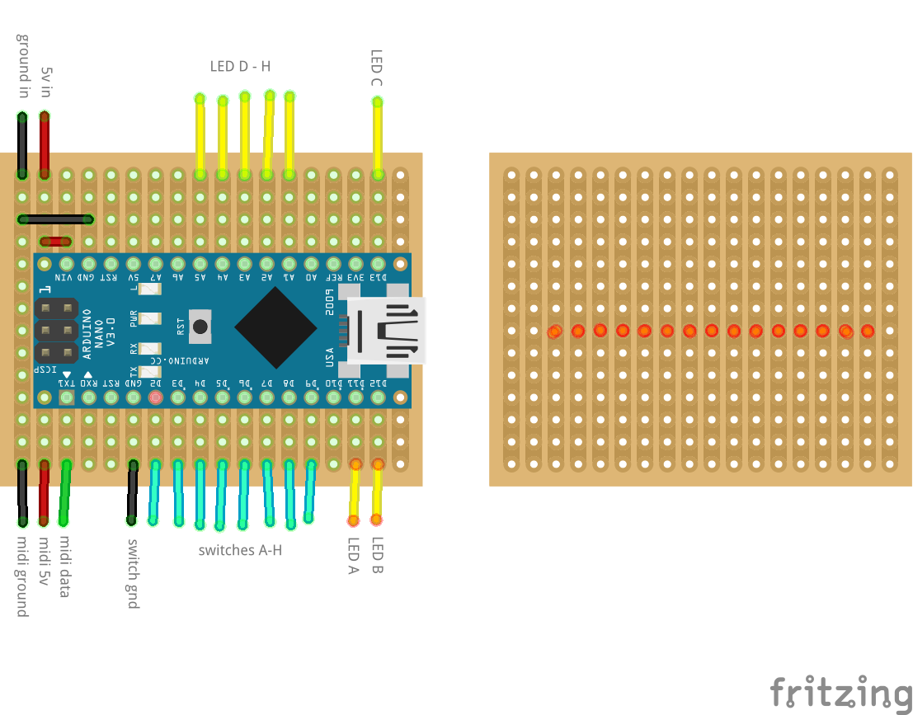

# quad-cortex-foot-switch
MIDI footswitch for switching between QC scenes.

## Parts List

1. Arduino Nano (Nano "Every")
2. 1590XX Aluminium Box - 9.2 * 3.8 * 3.2cm (L x W x H)
3. 8x Momentary switches (https://www.aliexpress.com/item/4000606891227.html)
4. 1x MIDI female connector (https://www.aliexpress.com/item/4000583940302.html)
5. USB-C socket (https://www.aliexpress.com/item/1005004564914143.html)
6. 8x 3mm LEDs
7. LEDs, stripe/perf board etc.

## Files 

* footswitch.ino - Arduino sketch.
* qc-footswtch-drill-template - Drill template for the 1590XX encosure.
* qc-footswitch-build-jig.stl - build jib to assemble everything outside of the enclosure (requires 3d printer).

