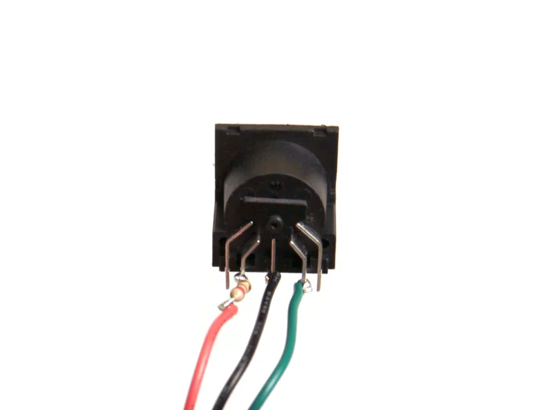

# quad-cortex-foot-switch v2

MIDI footswitch for switching between QC scenes.


More pictures: https://imgur.com/a/Fm4U8BB

## Parts List

1. Arduino Nano
2. 8x PCB mount momentary switches (https://www.aliexpress.com/item/32924115689.html)
3. 1x MIDI female connector (https://www.aliexpress.com/item/4000583940302.html)
4. USB-C socket for power (https://www.aliexpress.com/item/1005004564914143.html)
5. 8x resistors (5-10k ohms)
6. 1x 220ohm resistor for MIDI socket.
7. 8x 8mm LEDs
8. B3B-XH-A, B2B-XH-A headers (ideally right angle due to the awkward arduno USB position)

## MIDI DIN output wiring

```
1 -
2 GND
3 -
4 DATA
5 5v (requires 220ohm resistor)
```



## Arduino Code

The [arduino sketch](qcfs_v2_arduino/qcfs_v2_arduino.ino) is included. It's extremely simple but observe the difference between a generic nano and the official "Every" nano.

## Drill/bending templates 

See: 

1. [front](qc-fs-front.svg)
2. [front](qc-fs-back.svg)

## Connector Placement Issue 

The baoard layout has a mistake where the power/midi headers interfere with the arduino USB connector if the arduino is connected directly to the board. 

To work around this I used sockets for the arduino pins which raise the arduino USB socket up to clear the headers. However right angle headers would probably work 
too.